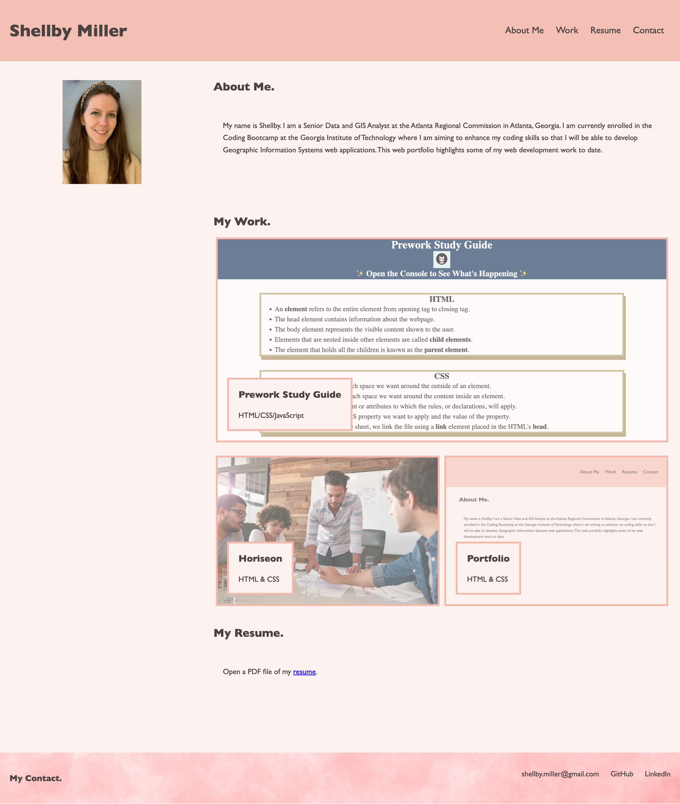

# 02-Challenge

## Description

The 02-Challenge project involved using html and advanced css to deploy a personal web portfolio.

Advanced css was used to build the personal portfolio, including flex attributes that allow images on the webpage to shrink when the window is resized. The portfolio inlcudes a name, profile picture, current web development projeccts, a resume, and contact info. The navigation bar links to the relavant section on the webpage. The images in the work section and the resume link opens related content in a new tab.

Alternative text was added to images on the website. A reset css was linked.

## Mock Up

The following image shows the web application's appearance and functionality:

## Link

https://swaguespack.github.io/02-challenge/

